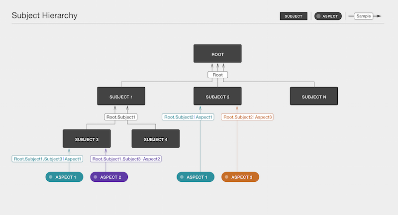
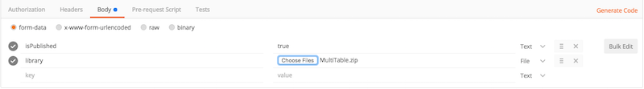

# Refocus
*Quick Start Guide*

  * [Why Use Refocus?](#why-use-refocus)
  * [Refocus Terminology](#refocus-terminology)
    * [Subject](#subject)
    * [Aspect](#aspect)
    * [Sample](#sample)
    * [Lens](#lens)
    * [Perspective](#perspective)
  * [Refocus Interface](#refocus-interface)
  * [Getting Started with Refocus](#getting-started-with-refocus)
    * [Refocus API](#refocus-api)
    * [Step 1: Use the API to create your subject.](#step-1-use-the-api-to-create-your-subject)
      * [Create a Root Subject](#create-a-root-subject)
      * [Create a Child Subject](#create-a-child-subject)
      * [Create Another Child Subject](#create-another-child-subject)
    * [Step 2: Use the API to create aspects.](#step-2-use-the-api-to-create-aspects)
    * [Step 3: Use the API to send a sample.](#step-3-use-the-api-to-send-a-sample)
    * [Step 4: Install a lens.](#step-4-install-a-lens)
    * [Step 5: Create a perspective.](#step-5-create-a-perspective)
    * [Step 6: Start using Refocus.](#step-6-start-using-refocus)
    * [Advanced Topics](#advanced-topics)
      * [Related Links](#related-links)

## Why use Refocus?

Refocus is a visualization platform for the status and health of anything you want to monitor.
If you care about how your service is performing *right now*, use Refocus to:

- **Understand**
  Understand your data in new ways by gaining insight

- **Connect**
  Connect various monitoring tools together into one unified platform

- **Visualize**
  Visualize your system health in beautiful and unambiguous ways

## Refocus Terminology
Let’s familiarize you with the terms we use in Refocus.

### Subject
  Anything that can be monitored. Yes, we mean anything! In Refocus, subjects are the center of our data model.

### Aspect
  A characteristic of a subject. An aspect can be anything that is measurable, such as average page times, wait times for a train, and even the weather. Anything!

### Sample
  The value of an aspect for a particular subject at a specified point in time. For example, a snapshot of subject status and health.

### Lens
  A visualization of the underlying Refocus data. Each lens provides a unique layout to represent the subject, child subjects, and samples.

  With the Lens Developer Kit (**coming soon**), you can create your own lens to meet your specific visualization needs. When you install your lens into Refocus, it will also be available to other users.

### Perspective
  A filtered view of a subset of data using a selected lens. You can save a perspective and share it with other Refocus users.

## Refocus Interface

Refocus displays real-time system status in a browser window based on the selected lens. The following lenses are available for Refocus.

- **MultiTable**
  A set of tables with the various subject components arranged like a menu board. You can view system status at a glance and expand the components for combos and sides.

- **Branch**
  An expandable set of system components, organized by the hierarchy each lives in. Click a branch to explore the component neighborhood.

- **Tree**
  An expandable display of system components, organized in a root, trunk, and branch hierarchy. Go out on a limb to view the status of individual components.

You can develop your own lenses with the [lens developer kit](./50-lensdevelopment.html) (LDK).

## Getting Started with Refocus
You have two ways to deploy Refocus. Select the one that best meets your needs.

- I want [one-click Heroku deployment](./03-quickstartheroku.html)
- I want to [download and build and deploy locally](./04-quickstartlocal.html)
- I want to [run Refocus locally as docker container](./05-quickstartlocaldocker.html)

Refocus requires that both Redis and PostgreSQL are running. After Refocus is deployed, create an account and sign in.

*OK, I've got Refocus deployed, and I'm signed in. Now what?*

Think about how you want to structure your visualization based on the Refocus hierarchy. The relationship between subjects, aspects, and samples looks like this:



As you work with Refocus, you’ll understand how these parts work together to best visualize your data.

### Refocus API

This guide uses the Refocus API extensively to show you how to get data into your custom deployment. You use an API client to do this. We like [Postman](https://chrome.google.com/webstore/detail/postman/fhbjgbiflinjbdggehcddcbncdddomop?hl=en).

We’ve outlined the API endpoints and body for each step. But to simplify it even further, you can use our [sample Postman collection](https://www.getpostman.com/collections/ee282b22f7b566eb437e) with the requests already set up. All you need to do is change each request’s URL to your own Refocus domain.

Note: API docs are available at `[YOUR_REFOCUS_HOST_AND_PORT]/v1/docs/`.

*Got it? OK, let's get started.*

## Step 1: Use the API to create your subject.

### Create a Root Subject

Remember that a subject represents anything that you’re monitoring.

Using your favorite API client , send a POST request to `/v1/subjects`. In the body of the request, use the following:

```json
{
  "name": "USA",
  "isPublished": true
}
```

The `isPublished` attribute enables a subject and allows you to create its child.

### Create a Child Subject

Because we’ve already created a root subject (USA), we can create its child with a POST to `/v1/subjects/USA/child` using the following body:


```json
{
  "name": "California",
  "isPublished": true
}
```

Refocus uses dot notation to refer to the path between the parent subject and the child subject. You’ll notice in the response that the absolute path to the new child is `USA.California`.

### Create Another Child Subject

Let’s create another child subject: San Francisco. This time, POST to `/v1/subjects/USA.California/child` (getting the hang of dot notation?) using the following body:

```json
{
  "name": "San_Francisco",
  "isPublished": true
}
```
To make the dot notation paradigm absolutely clear: If we created a child of San Francisco, such as Financial District the absolute path would be `USA.California.San_Francisco.Financial_District`. We’ll leave this exercise for your further practice.

*Great job! We've created a small subject hierarchy with USA as the root subject.*

Let’s create our aspects now.

## Step 2: Use the API to create aspects.

An aspect is a characteristic of the monitored subject.

So we want to monitor the unemployment rate and daily Gross Domestic Product (GDP) across the United States. Let's create the unemployment rate aspect first.

POST to `/v1/aspects` using the following body:

```json
{
  "isPublished": true,
  "name": "unemploymentRate",
  "criticalRange": [21, 50],
  "warningRange": [11, 21],
  "infoRange": [7, 11],
  "okRange": [0, 7],
  "timeout": "5d",
  "valueType": "PERCENT"
}
```
The different ranges in the body of this request allow you to customize the thresholds for the aspect. When Refocus is determining which status to set for a particular sample of data, it does a linear scan through these ranges. This is why the `criticalRange` lower bound is 21 and the upper bound for `warningRange` is also 21. These bounds ensure that Refocus is able to determine a status for 20.35, for example, which is in the warning range but not yet a critical value.

In our example, we’ve set the `valueType` field to express a percentage, but you also have the option to specify a Boolean or numeric value. Using a similar approach, you can create the daily GDP aspect.

POST to `/v1/aspects` using the following body:

```json
{
  "isPublished": true,
  "name": "gdp",
  "criticalRange": [0, 2000000000],
  "warningRange": [2000000001, 4000000000],
  "infoRange": [4000000001, 5500000000],
  "okRange": [5500000001, 10000000000],
  "tags": [
    { "name": "economic" }
  ],
  "timeout": "1d",
  "valueType": "NUMERIC"
}
```
The `timeout` field refers to the acceptable lapse in time between an update. You can customize it for various units of time. For instance, `2s` sets the timeout to 2 seconds. Likewise, `5m` refers to 5 minutes, and `1d` refers to 1 day. A sample is assigned a timeout status if no new data is received within this time period.

Another interesting attribute to note is `tags`. Tags are useful because they can help categorize your aspects. In this case, we’ve included the tag “economic” for our GDP aspect.

If you care about the order in which aspects are displayed, you can assign a “rank” to each aspect: lenses can render aspects sorted in ascending order by rank (numeric, nulls last) then within rank in ascending order by name (alphanumeric).
For example, given a list of aspects like this: [{ name: “Zebra”, rank: 1, ... }, { name: “Elephant”, rank: 10, ... }, { name: “Aardvark”, rank: null, … }, { name: “Lion”, rank: 1, …}] you would expect a lens to order aspects like this: [“Lion”, “Zebra”, “Elephant”, “Aardvark”].

*Nice job! We've set up the subject hierarchy and monitored aspects.*

### Step 3: Use the API to send a sample.

A sample is the value of an aspect for a particular subject at a specified point in time.

Let’s send some data to our aspects. We can push data to aspects individually or through a bulk upsert. Because we have multiple values to upload, it’s more convenient and less resource-intensive (therefore better for overall system health and performance) to use the bulk upsert API endpoint.

Following up on the dot notation when referring to root and child subjects, we use a pipe when referring to a particular aspect. For instance, to upload a data sample for California’s GDP, the path is `USA.California|gdp`. The path is the absolute path, `USA.California`, not just `California`.

Let's do a bulk upsert, and upload all our data samples in one POST request.

POST to `v1/samples/upsert/bulk` using the following body:

```json
[
  {
    "name": "USA.California|gdp",
    "value": "6754716841"
  },
  {
    "name": "USA.California|unemploymentRate",
    "value": "6.3"
  },
  {
    "name": "USA.California.San_Francisco|unemploymentRate",
    "value": "9.2"
  }
]
```
California's daily GDP looks A-OK! Remember to keep pushing new samples within the timeout period; otherwise, it defaults to a timeout. Another thing to note is the `messageCode` and `messageBody` attributes. They are optional body attributes that are particularly useful when incoming samples are not OK. Populate these attributes to help your users better understand the context around the current status and potentially resolve it faster.

To confirm that you have set up your hierarchical data correctly, you can always make a GET to `/v1/subjects/USA/hierarchy`.

*Are we done yet?*

Almost, but not quite. We need to set up our lens and perspectives to visualize the data we’ve pushed.

## Step 4: Install a lens.

Different lenses enable you to focus on different things, so it’s important to completely understand what you want to focus on. For now, the process of installing a lens is available only by using the API. However, the UI is coming soon, we promise!

At this step, you need to select the lens best suited for your use. We’re going to  use the MultiTable lens. A lens is deployed as a zip file. Download the MultiTable Lens from [here](https://github.com/salesforce/refocus-lens-multitable/tree/master/dist).

Upload the MultiTable lens that you downloaded earlier to your Refocus deployment. Ensure that headers in Postman are disabled. Do a new POST request with the endpoint set to `/v1/lenses`.

Upload the lens by completing the following steps.
 1. Under **Body > form-data**, set the key to **library**.
 2. Change the value field to **File**.
 3. Click **Choose Files**, and select the MultiTable lens zip file that you downloaded earlier.
 4. Add an isPublished key and set the value to **true**.

Your form-data (in key-value format) looks like the following:



*Almost there!*

## Step 5: Create a perspective.

A perspective is a display of subject and sample data using a selected lens. Right now, you can only create and modify perspectives using the API, but the UI is coming soon.

Create a basic perspective with a POST to `/v1/perspectives` using the following body:

```json
{
    "name": "test-perspective",
    "lensId":"your-lensId-goes-here",
    "rootSubject":"USA"
}
```

*Congrats, you’ve created a perspective and are ready to visualize the health of the USA!*

## Step 6: Start using Refocus.

Navigate back to your Refocus deployment and log in again. You should now see the `test-perspective` we created in the previous step under the Perspectives list. Click it to begin your visualization!

## Advanced Topics

### Related Links

For both subjects and aspects, you can include the optional attribute `relatedLinks` as a part of the request body. This attribute is an array of linked objects with each having a name and a URL. For quick access, lenses can display these related links when a user clicks or hovers over a subject or sample. The following example creates a new subject, `California`, under `USA`, with a direct link to the official state website.

POST to `v1/subjects/USA/child` using the following body:

```json
{
    "name" :"California",
    "isPublished": true,
    "relatedLinks": [
        { "name": "CAGov", "url": "http://www.ca.gov/" }
    ]
}
```
### Request Rate Limiting

Refocus lets you limit the number of requests per user--once the user reaches the limit for the specified time interval, subsequent requests will get http status code 429 (Too Many Requests).

Configure your limits using the following environment variables:
For more details, see the [express-limiter](https://www.npmjs.com/package/express-limiter) module.

- `EXPRESS_LIMITER_PATH` - the URI to limit. Can be any valid [express path](http://expressjs.com/en/4x/api.html#path-examples). To specify multiple paths, separate them with commas, e.g. "/v1/aspects,/v1/subjects". Use "*" to limit  all requests
- `EXPRESS_LIMITER_METHOD` - the HTTP method to limit. Can be any valid [express method](http://expressjs.com/en/4x/api.html#app.METHOD). To specify multiple methods, separate them with commas, e.g. "post,put,patch". Use "all" to limit all methods.
- `EXPRESS_LIMITER_LOOKUP` - the value(s) to lookup on the request object. default: 'headers.UserName'. To specify multiple values, separate them with commas, e.g. "headers.UserName,headers.x-forwarded-for".
- `EXPRESS_LIMITER_TOTAL` - the total number of requests allowed by each user in the specified time interval
- `EXPRESS_LIMITER_EXPIRE` - the time interval in milliseconds after which the limits are reset
- `EXPRESS_LIMITER_TOTAL_2` - use this to configure a secondary limiter. Leave blank to only use the primary limiter.
- `EXPRESS_LIMITER_EXPIRE_2` - use this to configure a secondary limiter. Leave blank to only use the primary limiter.

The following headers will then be added to the response:

- `x-ratelimit-limit` - the total number of requests allowed by this user in each time interval
- `x-ratelimit-remaining` - the total number of requests this user can make before the time interval is reset
- `x-ratelimit-reset` - the Unix timestamp of the next time interval reset


*Built with love by the Site Reliability Tools team @ Salesforce.*
