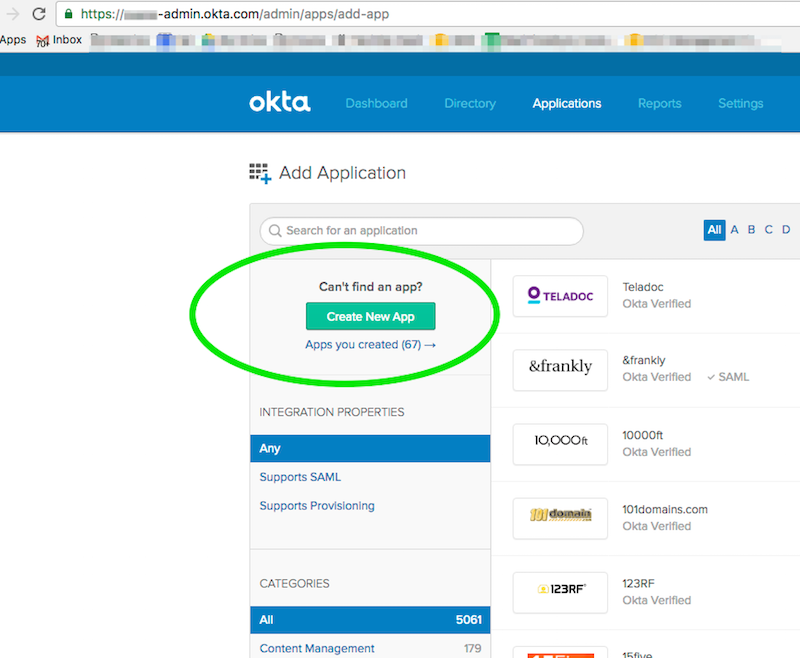
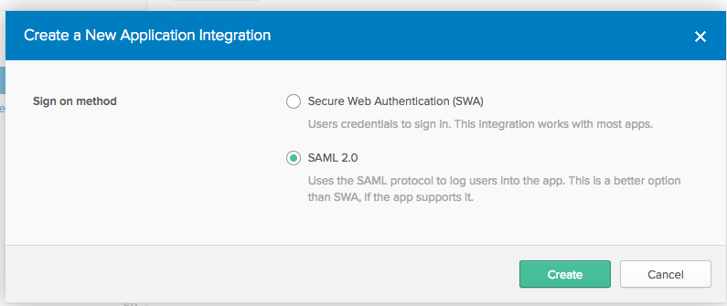
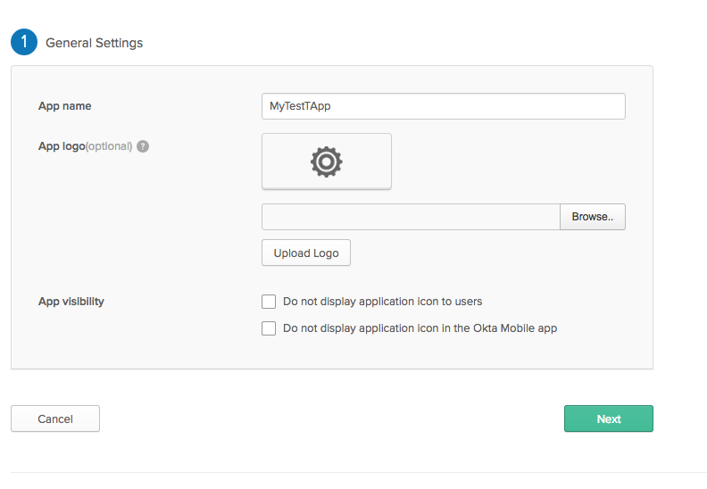
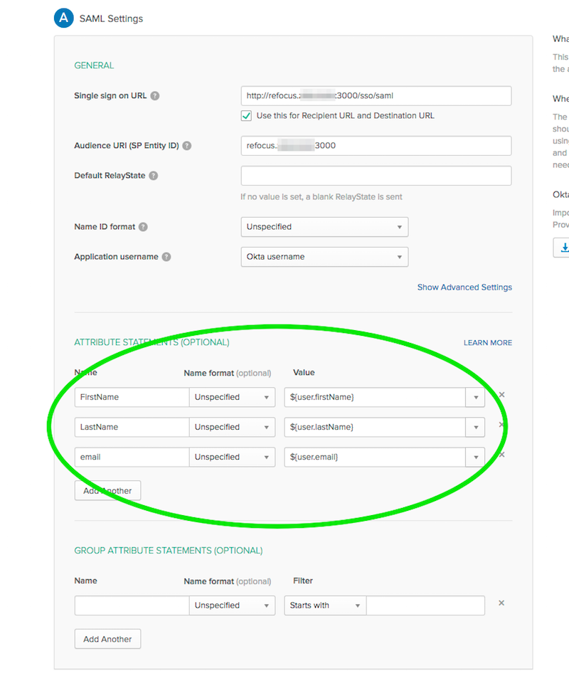
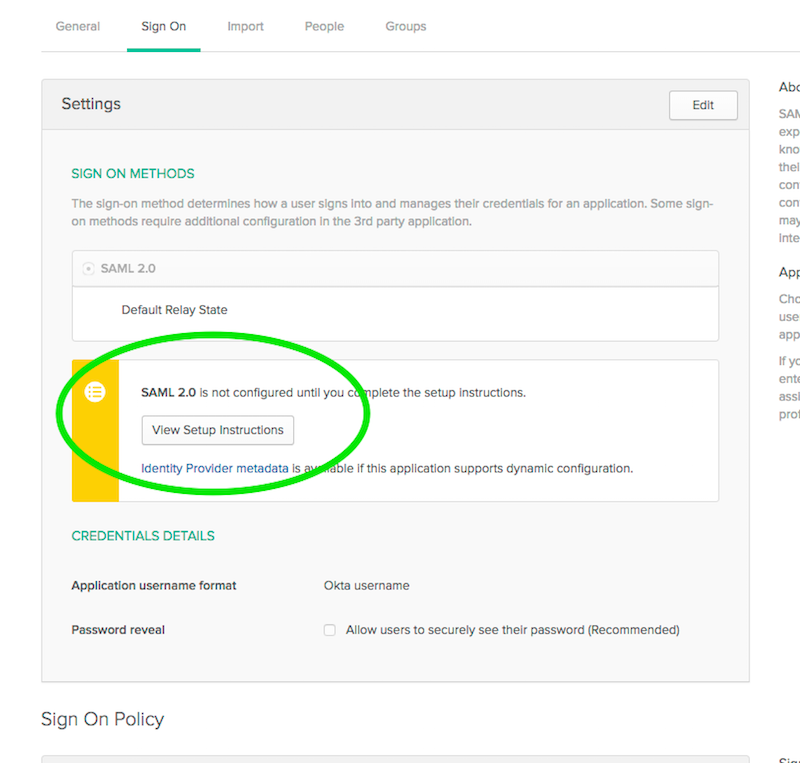
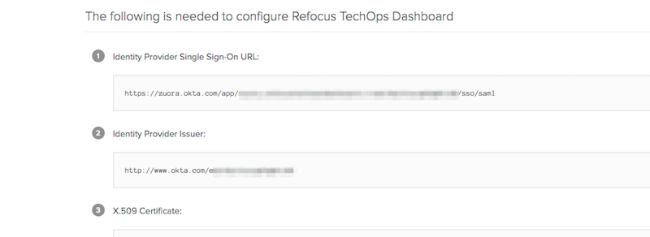
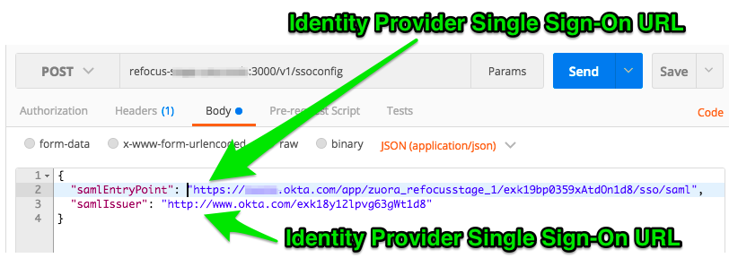

# SSO Setup with OKTA

This page will guide you through the Single Sign On Setup of refocus
using OKTA authentication. You will need to be an OKTA administrator to
set this up.

## Configure OKTA

If you are an experienced OKTA administrator you can skip to
[Refocus Specific Configuration](#Refocus-Specific-Configuration)

Create your new application in the Admin->Applications section of OKTA:

Set your sign on method to "SAML 2.0":

Add your application name, this is only used for display within OKTA so
can be anything you wish. Upload a logo if you want as well, maximum
size is (1400x900)

### Refocus Specific Configuration 

After clicking "Next" you should see the "Sign On Policy" page. These
are the most important OKTA settings to get right.

For the "Single sign on URL" field, put your Fully Qualified Domain name
for your application. The "Audience URL" is the same value as "Single
sign on URL", without the protocol preamble.

Make sure "Name ID Format" is "Unspecified" and "Application username"
is "Okta username"

Pay close attention to the values in the "ATTRIBUTE STATEMENTS" section
including the case of the values, as shown below these values need to
be:

| Name      | Name format | Value             |
|:----------|:------------|:------------------|
| FirstName | Unspecified | ${user.firstName} |
| LastName  | Unspecified | ${user.lastName}  |
| email     | Unspecified | ${user.email}     |

## Configure refocus

Still in OKTA click on "View Setup Instructions":

You will see these two links, which need to be added to refocus via a
POST request to <refocus-FQDN>:3000/v1/ssoconfig>

To do the post,
[Postman](https://chrome.google.com/webstore/detail/postman/fhbjgbiflinjbdggehcddcbncdddomop?hl=en)
is recommended, but any interactive API program is fine. Your postman
POST will look like this:

## Test your configuration

Once the "POST" is successful you are all set. Do a "GET" of the same
URL just to me sure.

Now select "SSO Login" on the refocus screen.

You should be redirected to OKTA for authentication, and when
successful, redirected back to refocus. If authentication is successful
but you are not seeing a valid screen inside of refocus, check the
[above settings](#Refocus-Specific-Configuration) again, **including the
case** of the variables.

If your signon is still not working, your next step is to look at the
`samlAuthentication` function in `refocus/View/loadView.js`
