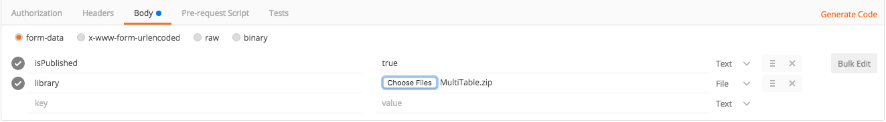

# Refocus Quick Start Guide

Refocus is a platform for visualizing the status of some set of subjects under monitoring. The platform does not attempt to provide visualizations to satisfy every type of user. Instead, it allows users to install add-on modules, which we call lenses, to provide new visualizations. Each lens provides a new visualization to help users understand their data in a new way.

Table of Contents
=================

  * [Refocus Quick Start Guide](#refocus-quick-start-guide)
    * [Why use Refocus?](#why-use-refocus)
  * [Quick Start](#quick-start)
    * [Step 1: Use the API to create your Subjects](#step-1-use-the-api-to-create-your-subjects)
      * [Create a root Subject](#create-a-root-subject)
      * [Create a child Subject](#create-a-child-subject)
      * [Create another child Subject](#create-another-child-subject)
    * [Step 2: Use the API to create your Aspects.](#step-2-use-the-api-to-create-your-aspects)
    * [Step 3: Use the API to send some samples.](#step-3-use-the-api-to-send-some-samples)
    * [Step 4: Install a lens](#step-4-install-a-lens)
    * [Step 5: Create a perspective](#step-5-create-a-perspective)
    * [Step 6: Refocus!](#step-6-refocus)
    * [Advanced Topics](#advanced-topics)
      * [Related Links](#related-links)
      * [Coming Soon: Auth Tokens](#coming-soon-auth-tokens)
      * [Create your own lens](#create-your-own-lens)
  * [Thank You!](#thank-you)


## Why use Refocus?

If you care about how your service is performing _right now_, use Refocus to:
- connect disparate monitoring tools into a self-service, unified platform
- visualize your service health beautifully and unambiguously

Before you go any further, now might be a good time to [get familiar with some of the terms we use in Refocus](./Glossary.md).

_OK, enough chit chat, let's get started already!_

# Quick Start

There are two options to set up Refocus. Select the one that best meets your needs:
- I want [one-click Heroku deployment](./QuickStartHeroku.md)
- I want to [download and build and deploy locally](./QuickStartLocal.md)

Ensure that your deployment, either on Heroku or locally, has both Redis and PostgreSQL running. Once deployed, create an account and sign in.

_OK, I've got Refocus deployed and I'm signed in, now what?_

Think about how you want to structure your subject hierarchy. 

This guide uses the Refocus API extensively to show you how to get data into your custom Refocus deployment. You will want an API client to help you do this. We like [Postman](https://chrome.google.com/webstore/detail/postman/fhbjgbiflinjbdggehcddcbncdddomop?hl=en). We've outlined the API endpoints and body for each step, but to simplify it even further you can use our [sample postman collection](https://www.getpostman.com/collections/ee282b22f7b566eb437e) with the requests already set up. All you need to do is change the URL for each request to your own Refocus domain.

Got it? OK, let's get started.

## Step 1: Use the API to create your Subjects

### Create a root Subject

> Remember that a subject represents a system under monitoring within the hiearchy.

Using your favorite API client , send a POST request to `/v1/subjects`

In the body of the request, use the following:

```json
{
  "name": "USA",
  "isPublished": true
}
```

The `isPublished` attribute enables a subject and allows us to create its child.

### Create a Child Subject

Since we've already created a root Subject ("USA"), we can create its child with a POST to ```/v1/subjects/USA/child```.
This time, use the following body:

```json
{
  "name": "California",
  "isPublished": true
}
```

Refocus uses dot notation to refer to the path between the parent subject to the child subject. You'll notice in the response that the ```absolutePath``` to this new child is "USA.California."

### Create another child Subject

Let's create one final child subject: San Francisco. This time, POST to ```/v1/subjects/USA.California/child``` (getting the hang of dot notation?)

Use the following body:
```json
{
  "name": "San_Francisco",
  "isPublished": true
}
```
To make the dot notation paradigm absolutely clear, the absolute path would be "USA.California.San_Francisco.Financial_District" if we were to create a child of San Francisco, such as Financial District. We'll leave this exercise to you for further practice.

Great job! We've created a small subject hierarchy with ```USA``` as the root subject.

Lets create our aspects now.

## Step 2: Use the API to create your Aspects.
> An aspect is a particular characteristic of the subject that we want to monitor.

For the purposes of this guide, we may want to monitor the unemployment rate and daily Gross Domestic Product (GDP) across the USA. Lets create the unemployment rate aspect first.

POST to ```/v1/aspects```.
Use the following body:
```json
{
  "isPublished": true,
  "name": "unemploymentRate",
  "criticalRange": [21, 50],
  "warningRange": [11, 21],
  "infoRange": [7, 11],
  "okRange": [0, 7],
  "timeout": "5d",
  "valueType": "PERCENT"
}
```
The different ranges in the body of this request allow you to customize the thresholds for the aspect. When Refocus is determining which status to set for a particular sample of data, it does a linear scan through these ranges. This is why although the ```criticalRange``` lower bound is 21, the upper bound for ```warningRange``` is 21. This will ensure that Refocus is able to determine a status for 20.35, for example, which will be classified as a warning. In addition, the values are in terms of percent, which we've indicated in the ```valueType``` field. Depending on your needs, you can choose from one of the three possible aspect types: ```BOOLEAN```, ```NUMERIC```, or ```PERCENT```. 

Similarly, create the daily GDP aspect:

POST to ```/v1/aspects``` using the following body:
```json
{
  "isPublished": true,
  "name": "gdp",
  "criticalRange": [0, 2000000000],
  "warningRange": [2000000001, 4000000000],
  "infoRange": [4000000001, 5500000000],
  "okRange": [5500000001, 1000000000],
  "tags": [
    { "name": "economic" }
  ],
  "timeout": "1d",
  "valueType": "NUMERIC"
}
```
The ```timeout``` field refers to the acceptable lapse in time between an update. It's customizable to various units of time. For instance, 2s sets the timeout to 2 second. Likewise, 5m refers to 5 minutes, and 1d refers to 1 day. If an aspect doesn't receive sample data within this timeout period, it will be marked as a timeout.

Another interesting attribute to note is ```tags```. Tags are useful because they can help categorize your aspects. In this case, we've included the tag ```economic``` for our GDP aspect.

Nice job! We've set up our subject hierarchy and the aspects we will be monitoring. 

### Step 3: Use the API to send some samples.
> A sample is a value for an aspect on a subject at a particular point of time.

Lets send some data to our aspects. We can push data to our aspects individually or through a bulk upsert. Since we have multiple values that we want to upload, it's far more convenient to use the bulk upsert API endpoint. 

Following up on the dot notation when referring to parents and its children, we use a pipe when referring to a particular aspect. For instance, if we wanted to upload a data sample for California's GDP, our path would be ```USA.California|gdp```. Also note that the path is the **absolute path**, "USA.California", not just "California."


With this in mind, lets do a bulk upsert and upload all of our data samples in one POST request.

POST to ```v1/samples/upsert/bulk``` using the following body:
```json
[
  {
    "name": "USA.California|gdp",
    "value": "6754716841"
  },
  {
    "name": "USA.California|unemploymentRate",
    "value": "6.3"
  },
  {
    "name": "USA.California.San_Francisco|unemploymentRate",
    "value": "9.2"
  }
]
```
California's daily GDP looks A-OK! Remember to keep pushing new samples within the timeout period, otherwise it will default to timeout. Another thing to note are ```messageCode``` and ```messageBody```. These are optional body attributes that can  be particularly useful when incoming data samples are in critical status. This metadata can help the Refocus user better understand the critical status and potentially resolve it faster.

To confirm your hiearchical data, you can always make a ```GET``` to ```/v1/subjects/USA/hierarchy```. 

_Are we done yet?_ 

Almost, but not quite. We need to set up our lens and perspectives to visualize this data we've pushed.

## Step 4: Install a lens
> Different lens enable you to focus on different things, so it's important to completely understand what you want to truly focus on.

For now, the process of installing a pre-built lens is only available via the API. However, the UI is coming soon, we promise! 

At this step, you'll need to select the lens best suited for your use. For the purpose of this guide, we'll use the Multi-Table lens. Pre-built lens are usually zip archives. To get the Multi-Table lens, do a ```git clone``` of [this repository](https://git.soma.salesforce.com/igoldstein/refocus-lens-multitable). The lens zip archive is under the dist folder.

Although this is a pre-built lens, you can develop your own custom lens for your needs with the lens developer kit (LDK). See more info about it [here](#create-your-own-lens).

Lets upload the Multi-Table lens we downloaded earlier to your Refocus. First, ensure that any headers are disabled in Postman. Do a new POST request with the endpoint set to ```/v1/lenses```. Afterwards, upload the lens by doing the following:

1. Under body > form-data, set the key to ```library```. 
2. Change the value field from text to file
3. Click "Choose Files" and select the multi-table lens zip that you downloaded earlier
4. Add another key, ```isPublished```, and set the value to ```true```

Your form-data (in key-value format) should look like the following: 



Almost there!

## Step 5: Create a perspective
> API only for now, UI coming soon.

A perspective is a combination of filters and lenses. Create a basic perspective with a POST to ```/v1/perspectives```.

Use the following body:
```json
{
    "name": "test-perspective",
    "lensId":"your-lensId-goes-here",
    "rootSubject":"USA"
}
```

Congrats, we've created our perspective and are ready to visualize the health of the USA!
## Step 6: Refocus!

Navigate back to the Refocus you deployed and signed into before we began this guide. You should now see "test-perspective" we created in the previous step now under the perspectives list in your Refocus. Click on it to begin your visualization!

## Advanced Topics

### Related Links

On both subjects and aspects, you can include an optional attribute, ```relatedLinks```, as a part of the request body. It's an array of objects, each with at least a name and URL. This will add the links to the subject/aspect detail modal in Refocus, enabling you to quickly accesss them as needed. The following example creates a new subject, California, under USA with a direct link to the official state website.

POST to ```v1/subjects/USA/child``` to create a 
```json
{
    "name" :"California",
    "isPublished": true,
    "relatedLinks": [
        { "name": "CAGov", "url": "http://www.ca.gov/" }
    ]
}
```
### Coming Soon: Auth Tokens

Refocus will soon also allow you to use auth tokens to add an additional layer of security on the platform. Stay tuned!

### Create your own lens
//TODO point at ldk

# Thank You!
Congrats on the deployment of your Refocus! If you have any questions or feedback, please reach out to us.


:sparkles:*Built with love by the Site Reliability Tools team @ Salesforce.*:sparkles:
